# Magpie Design Changes and Reasoning

## Major Design Changes

### CAD Assembly
| Old | New |
|---|---|
| 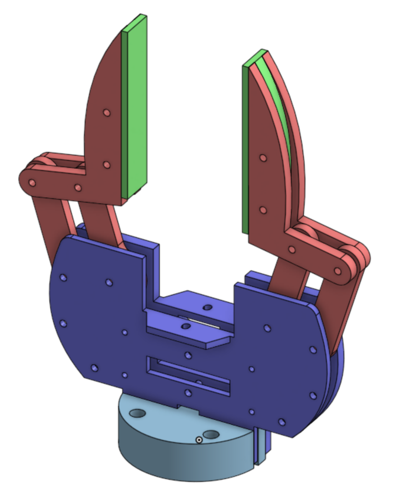 | 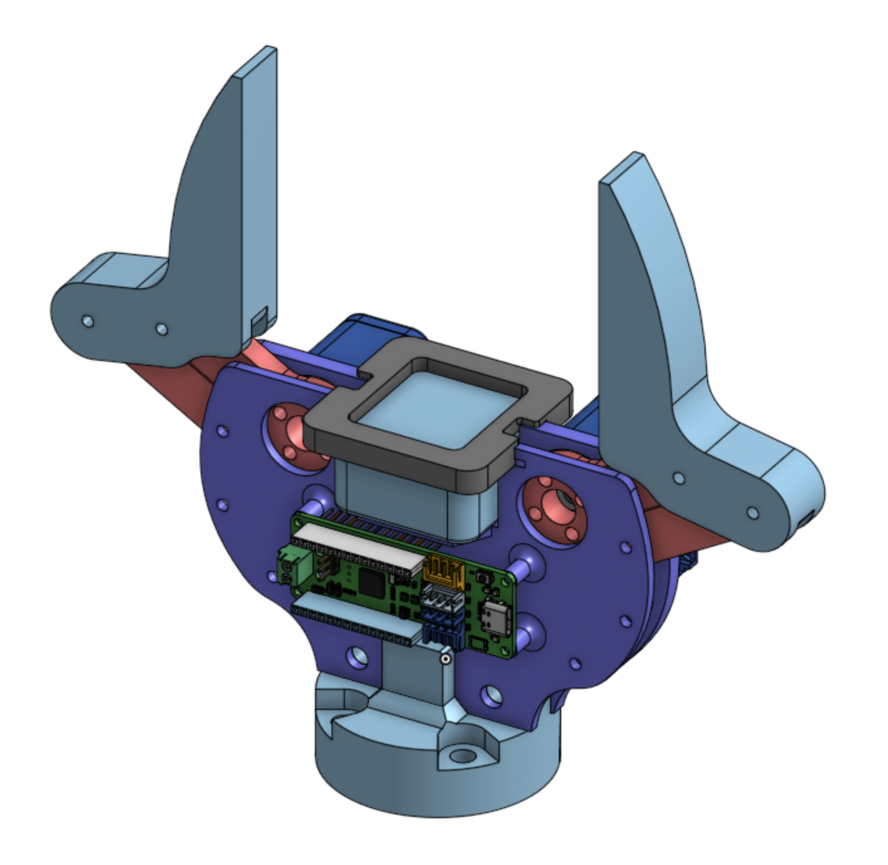 |

### Camera Mount: Sliders to Holes
Changed the camera mount from sliders to holes. This allows the camera to be mounted in a repeatable position, which is important for accuracy when grabbing objects.

| Old (sliders) | New (holes) |
|---|---|
| 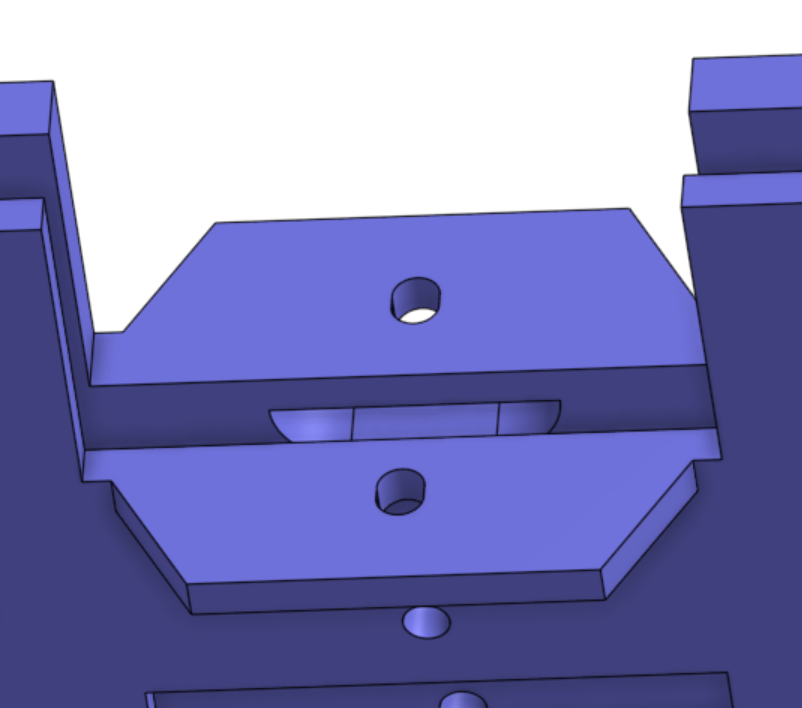 | 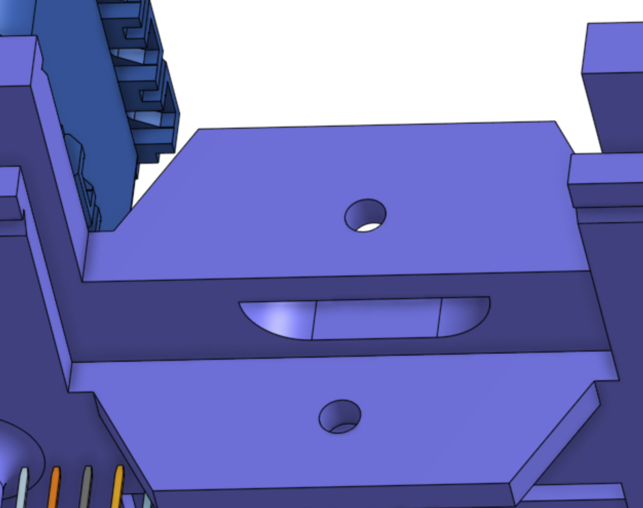 |

### Crank Access Holes
Added holes to access the screws on the crank. The rocker and crank are the weakest 3D-printed parts of the gripper. If the crank breaks, these access holes mean it can be removed without fully disassembling the gripper.

| Old (no access holes) | New (access holes) |
|---|---|
| 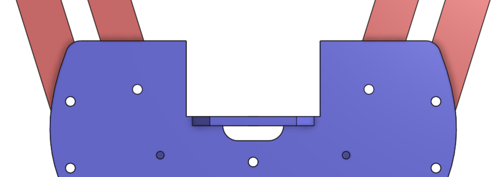 | 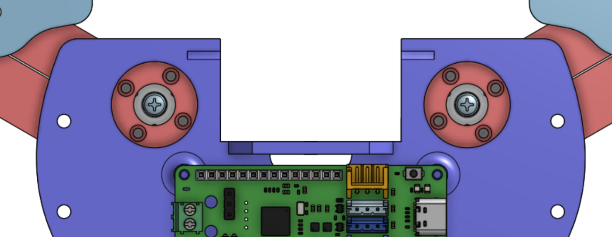 |

### Fingers Combined into a Single Part
The fingers originally consisted of three separate parts. This design allowed the contact surface (the part that touches the object being picked up) to be printed separately in TPU. Combining the fingers into a single part simplifies both the design and assembly, but it requires grip tape to be added to maintain the same performance.

| Old (three part finger) | New (one part finger) |
|---|---|
| 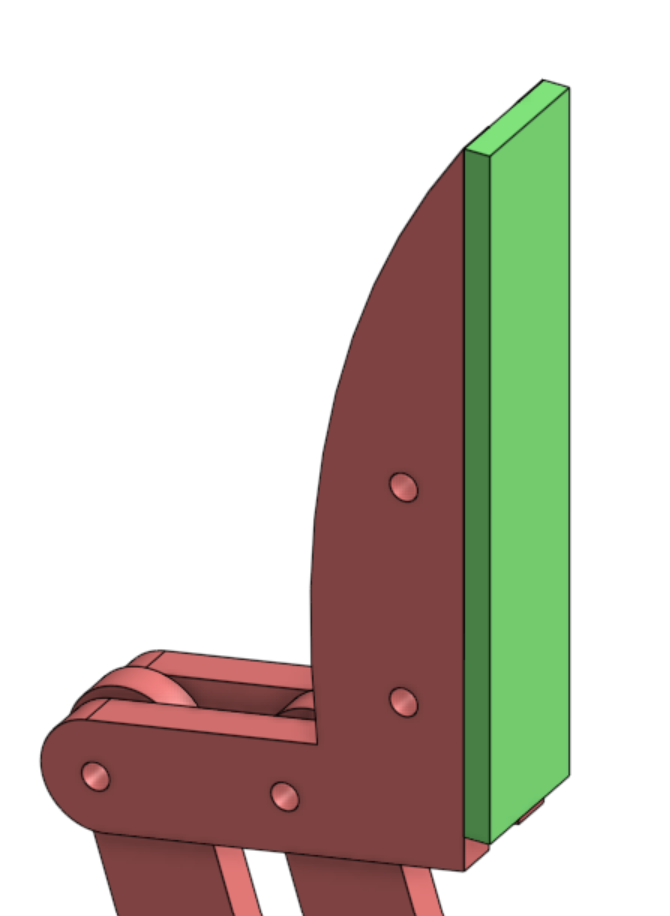 | 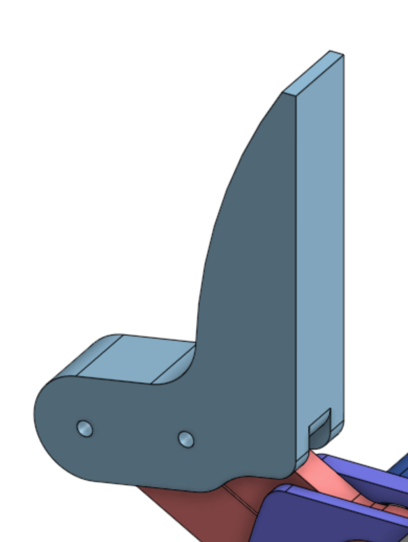 |

### Increased Rocker and Crank Thickness
Since the rocker and crank are the weakest parts of the system, their thickness was increased to maximize strength within the available space constraints. These parts should be printed with at least 50% infill.

Additionally, the crank originally included extra height in the section that connects to the servo, which conflicted with the servo footprint. This required assembly with 8mm standoffs instead of the 6mm standoffs shown in the CAD assembly. Given our current stock of standoffs and the goal of maximizing the strength of the rocker and crank, revision two of the Magpie gripper was designed around 8mm standoffs.

### Base Top and Bottom Changes
- **Increased cable pass-through hole:** Makes assembly and disassembly easier.
- **Changed OpenRB-150 mounting:** Originally required additional standoffs; the 3D-printed design now has standoffs built in. There may be strength concerns, since this is a small section with unfavorable layer-line orientation.
- **Repositioned OpenRB-150 mounting:** Moved away from nearby screws to leave more room for wires.
- **Modified shape near the base:** The original design had an abrupt transition connecting the mounting holes to the rest of the gripper, which appeared to be a weak point. Additional material was added to create a more gradual transition and increase strength.

| Old | New |
|---|---|
| 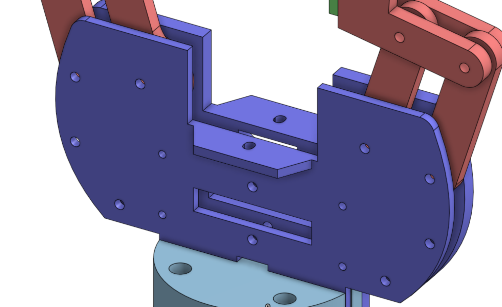 | 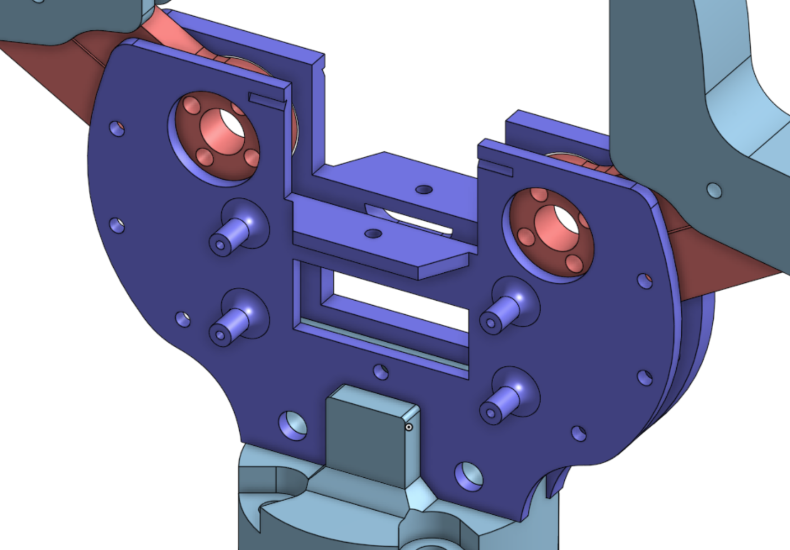 |

### Camera Cover
Changed the camera cover from two separate parts screwed in on either side to a single part that snaps onto the top. This may raise concerns about how well it protects the camera and servos from foreign object debris (FOD), which could require a full enclosure.

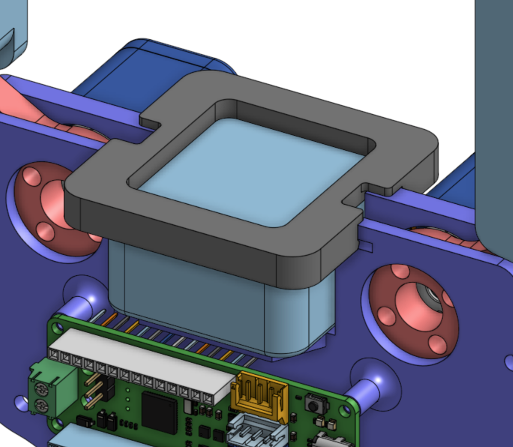
<!-- TODO: add photo of old two-piece camera cover (missing CAD assembly) -->

### Wire Cover
Added a wire cover to help protect the servo and camera cables while bracing against the arm.

### New H1-2 Mount
Simplified the H1-2 mount, as the original design was more complex than necessary. The main concern is that the new part is weaker than the original mount; printing with higher infill could help address this.

### Smaller Design Changes:
- Added fillets to OpenRB-150 standoffs
- Added small divots in both sides of the base plates for camera cover
- Increased the size of M3 holes to 3.4mm to avoid threading 3D printed parts
- Added a cover for the finger part to reduce play and increase strength

## Current Work

### New UR5 Mount
Testing a new UR5 mount intended to simplify mounting and removal. Outstanding concerns include:
- Potential weak points due to limited space and layer-line orientation.
- Screws that may block one another.

<!-- TODO: add photo of new UR5 mount -->
