# Magpie Gripper V2 — assembly

The same guide as [`Magpie Assembly Guide.pdf`](Magpie%20Assembly%20Guide.pdf), in a
form GitHub renders — no download, and it works on a phone propped up next to the
bench. The PDF is still the one to print.

Full-resolution photographs of the whole build, including the shots that did not
make it into the guide, are in [`assembly_photos/`](assembly_photos).

**Before you start:** read [the bill of materials](BOM.md) and check every item is
on the bench. Quantities there are per completed gripper.

---

## Overview

The Magpie gripper is a versatile, 3D-printed robotic end-effector for precision
grasping and vision-based manipulation. Two Dynamixel AX-12A servos, controlled
through an OpenRB-150 board, drive a four-bar linkage (crank and rocker) that
keeps the fingers parallel through their whole range of motion. An Intel
RealSense D405 depth camera sits in the palm, which is what makes autonomous
grasping possible.

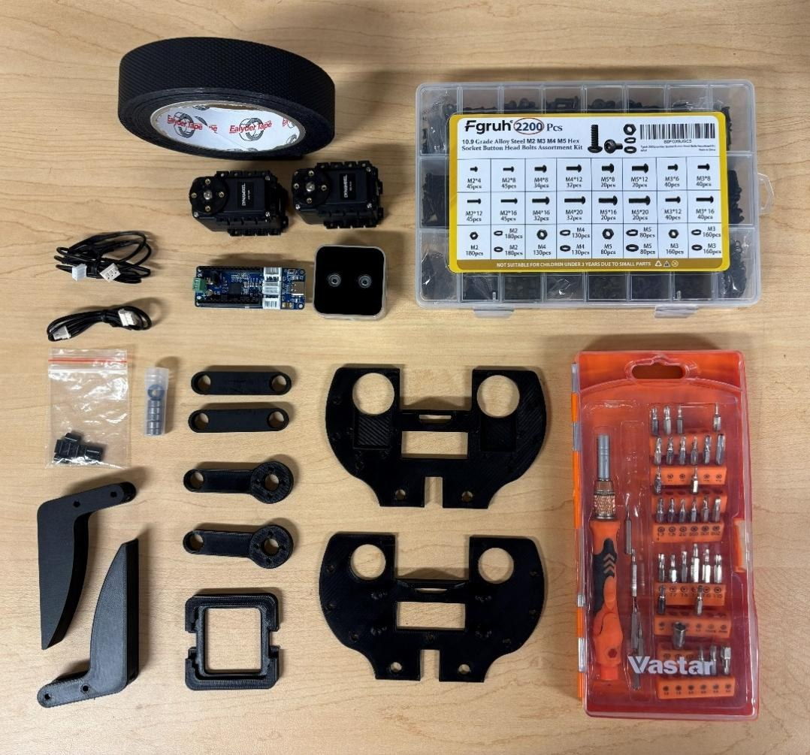

## Safety

> [!CAUTION]
> **Disconnect all power before wiring or rewiring the AX-12A servos or the
> OpenRB-150 board.** Connecting power with reversed polarity permanently damages
> the servo electronics.

> [!WARNING]
> The parallel linkage and the fingers create severe pinch hazards. Never put your
> fingers or hands between the jaws or the linkages while the servos are powered.

- Work on a clean, static-safe, well-lit surface.
- Handle the RealSense D405 by the edges of its housing — not the lens or the IR emitters.
- Do not force fasteners. If a screw will not thread smoothly, back it out, check the alignment, and try again.
- Support a printed part near the hole you are fastening, so thin PLA walls do not crack.
- Keep clear of the jaws whenever the gripper is powered and under servo control.

## Tools (not included)

- 2 mm and 3 mm Allen keys
- A small flat-head screwdriver
- A USB-A to USB-C cable for the OpenRB-150

---

## Step 1 — Prepare the fingers

Cut the grip tape into two equal strips and press one firmly onto the inner
gripping surface of each finger. No air bubbles; edges flush with the plastic.

## Step 2 — Install the AX-12A servos

Seat the two servos in the mounting brackets on the bottom base with the splines
— the rotating output shafts — **facing inwards**. Secure each with four M2 nuts
and bolts.

<table>
<tr>
<td>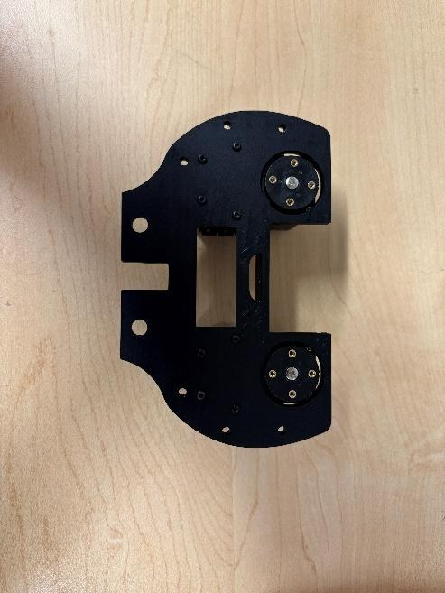</td>
<td>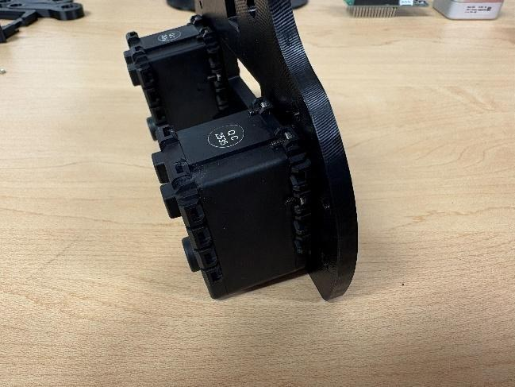</td>
</tr>
<tr>
<td align="center">Both servos installed, viewed from below, output horns visible.</td>
<td align="center">The same pair edge-on, showing the flange screws.</td>
</tr>
</table>

## Step 3 — Build the crank and coupler linkage

Press the 5 mm bearings into the circular housings in the servo cranks and
rockers — **two bearings per rocker, one per crank**.

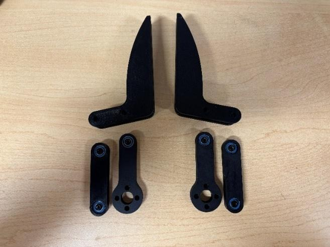

Line the mounting holes in the base of each finger up with the end points of the
cranks and rockers, and secure them with M3 bolts. Work the linkage by hand and
check it moves smoothly before going on.

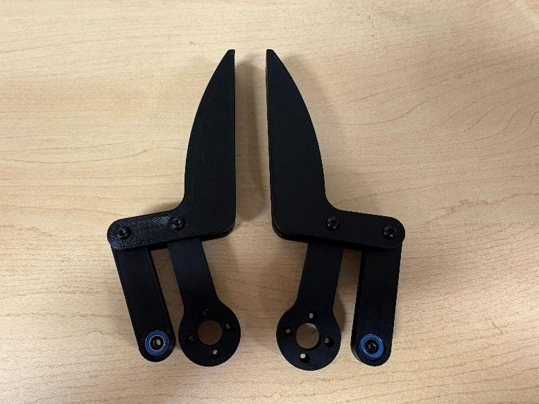

## Step 4 — Mount the servo rockers and fingers

Attach a servo crank to the installed servo's output horn with the horn screw
supplied with the AX-12A, plus four M2 bolts. **The notch on the servo must line
up with the arm.**

Connect the finger + coupler subassembly from step 3 to the crank's outer pivot
with M3 bolts and an 8 mm standoff, completing the four-bar linkage on this side.

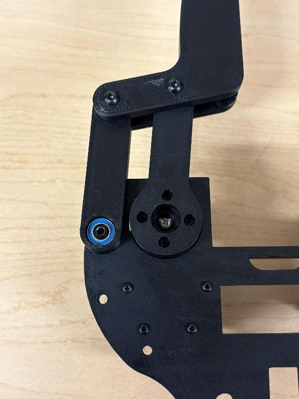

## Step 5 — Repeat on the second side

Repeat steps 2 to 4 on the other side of the housing: lay out the second finger,
crank and coupler, pre-assemble the finger + coupler, and attach it to the second
servo's horn.

With both sides built, cycle each finger by hand and confirm the motion is smooth
and symmetrical before continuing.

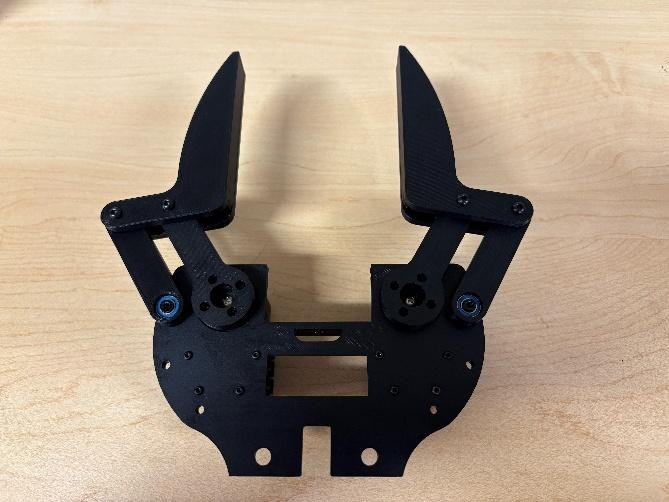

## Step 6 — Join the top base

Four M3 screws hold the top base to the rest of the assembly. There are further
holes for more standoffs and screws; they are not necessary.

<table>
<tr>
<td>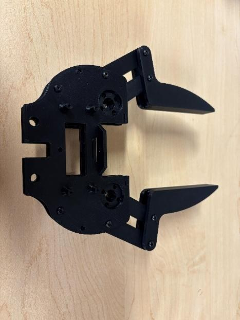</td>
<td>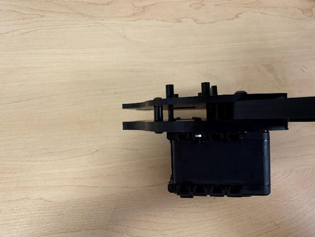</td>
</tr>
</table>

## Step 7 — Install the RealSense D405

Match the camera orientation to the figures, **cable facing the servo side**.
Do not use M3 screws longer than 6 mm here.

<table>
<tr>
<td>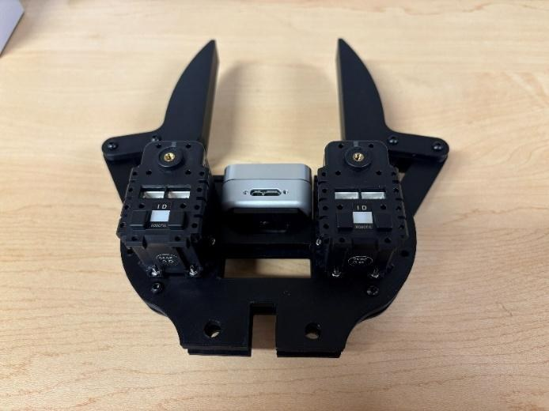</td>
<td>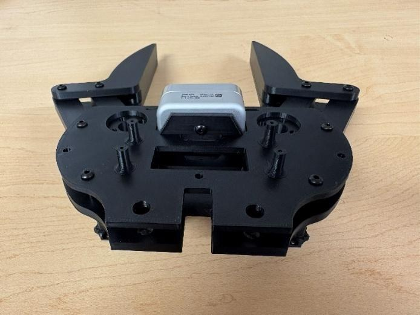</td>
</tr>
</table>

## Step 8 — Install the OpenRB-150

Four M2 screws. The printed part is not threaded, so it helps to drive the screws
into the plastic once before mounting the board.

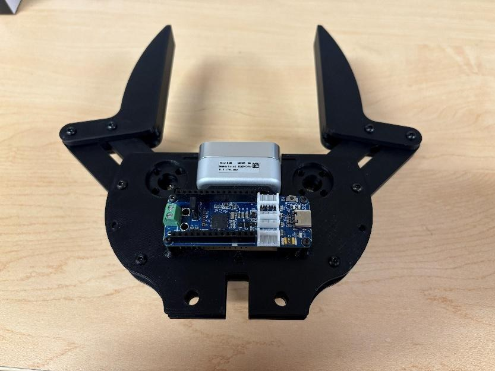

## Step 9 — Fit the camera protector

Orientation matters, because the top and bottom plates are different sizes. Find
the right way round and snap the part in with reasonable pressure.

<table>
<tr>
<td>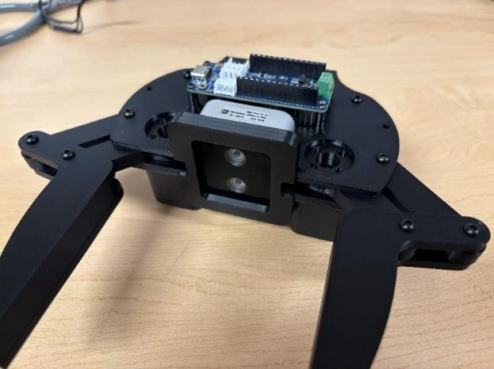</td>
<td>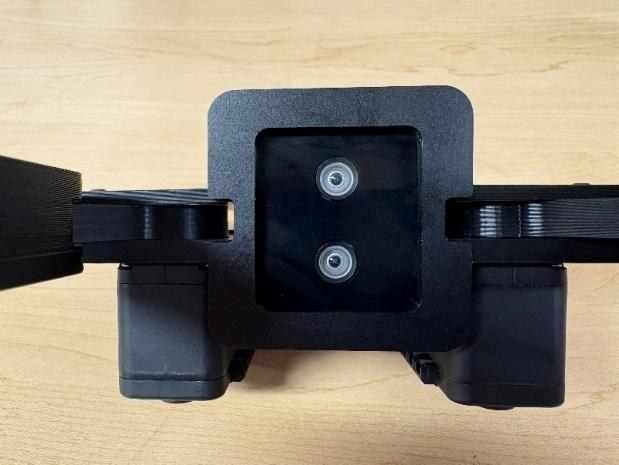</td>
</tr>
</table>

## Step 10 — Wiring, cable routing and addresses

Route the EH-to-Molex cable through both base plates: the EH connector goes to the
OpenRB-150, the Molex connector to one of the servos.

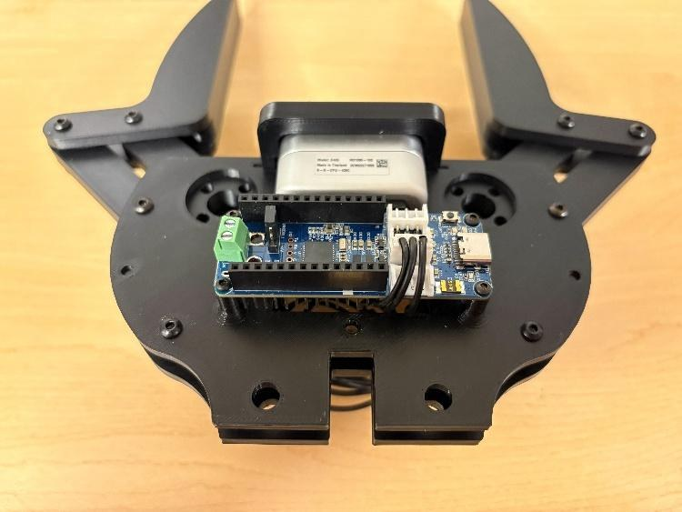

**Servo addresses.** In the orientation above — board on top — the **right servo is
ID 1** and the **left servo is ID 2**. Servos ship set to ID 1, so setting the
addresses usually means connecting one servo at a time. Use
[Dynamixel Wizard 2.0](https://emanual.robotis.com/docs/en/software/dynamixel/dynamixel_wizard2/),
and connect the left servo first. While you have a servo connected, set its
maximum clockwise and counter-clockwise positions — that is what keeps it from
stalling against the mechanism.

**Camera calibration.** Set the D405 up a known distance from a surface and enter
that distance, using the RealSense Viewer from the
[RealSense repository](https://github.com/IntelRealSense/librealsense).

<table>
<tr>
<td>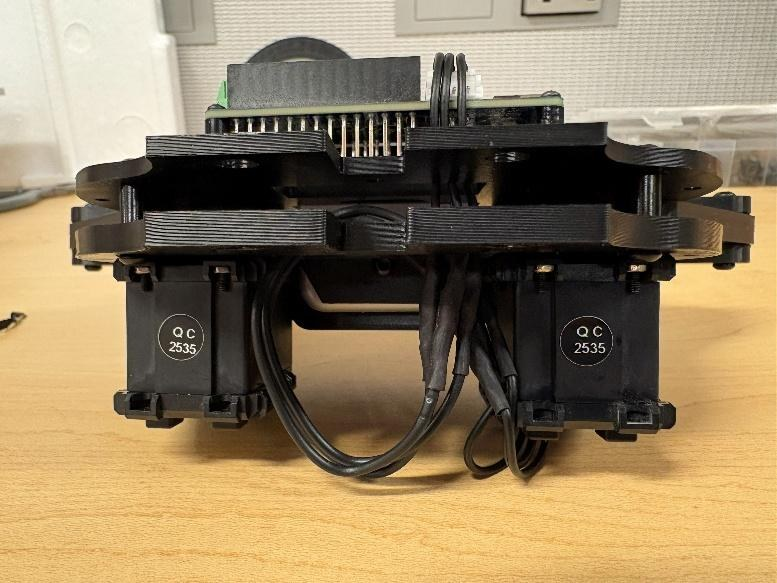</td>
<td>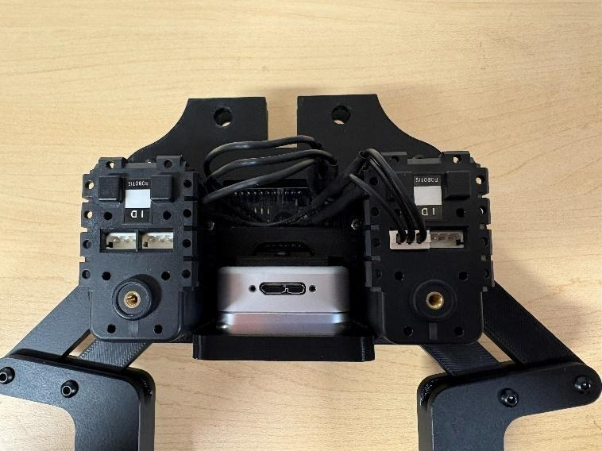</td>
</tr>
</table>

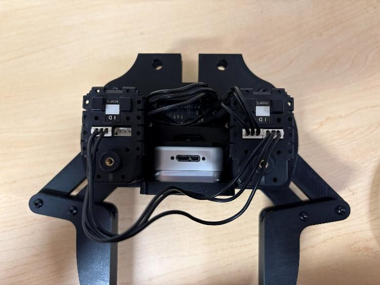

## Step 11 — Final hardware check

- Cycle each finger by hand, unpowered, through its full open and close range. The
  motion should be smooth, with no binding at the coupler or rocker pivots.
- Recheck that every M3 and M2 fastener from steps 1–7 is snug, and that no
  standoff has backed out of the bottom base.

---

## Troubleshooting

| Symptom | What to check |
| --- | --- |
| **Fingers do not move symmetrically** | Both cranks must be installed with the servo horns centred. A horn fitted off-centre makes one jaw lead the other. |
| **Binding or rough motion in the linkage** | Loosen the affected coupler or rocker fastener slightly. Pivots should turn freely with little or no axial play — not be clamped tight. |
| **OpenRB-150 does not detect a servo** | Check the daisy-chain wire orientation and that both connectors are firmly seated, at the servo and at the board. Confirm the servo's baud rate and ID match your control software. |
| **Camera not detected over USB** | Reseat the D405 connector. An overtightened cable screw stresses the internal cable. |

## Calibration

Both the RealSense D405 and the AX-12A servos are calibrated in
[step 10](#step-10--wiring-cable-routing-and-addresses).

## Maintenance

- Inspect the M3 and M2 fasteners periodically — vibration loosens them — and re-torque as needed.
- Clean the D405 lens with a microfibre cloth only. No solvents.
- Check the 5 mm bearings for smooth rotation every few hundred grip cycles, and replace them if roughness or play develops.
- Store the gripper with the fingers open, to keep preload off the linkage.

---

Once it is together, the software that drives it — force control, the palm
camera, grasping and planning — lives in
[correlllab/MAGPIE](https://github.com/correlllab/MAGPIE).
