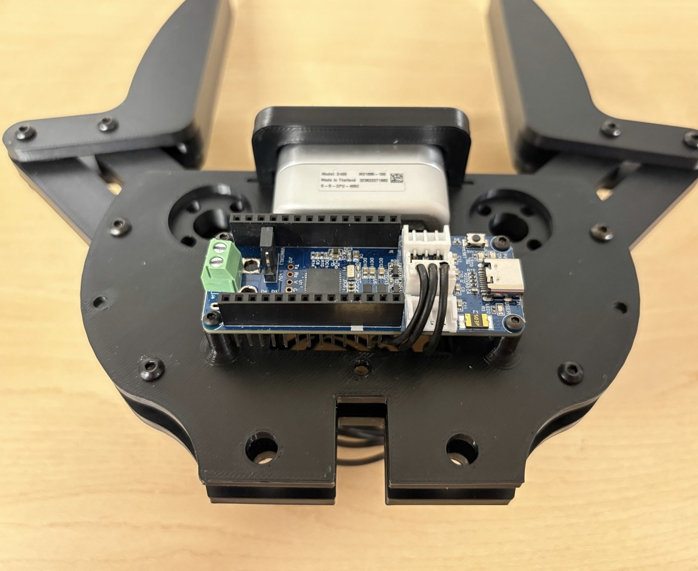
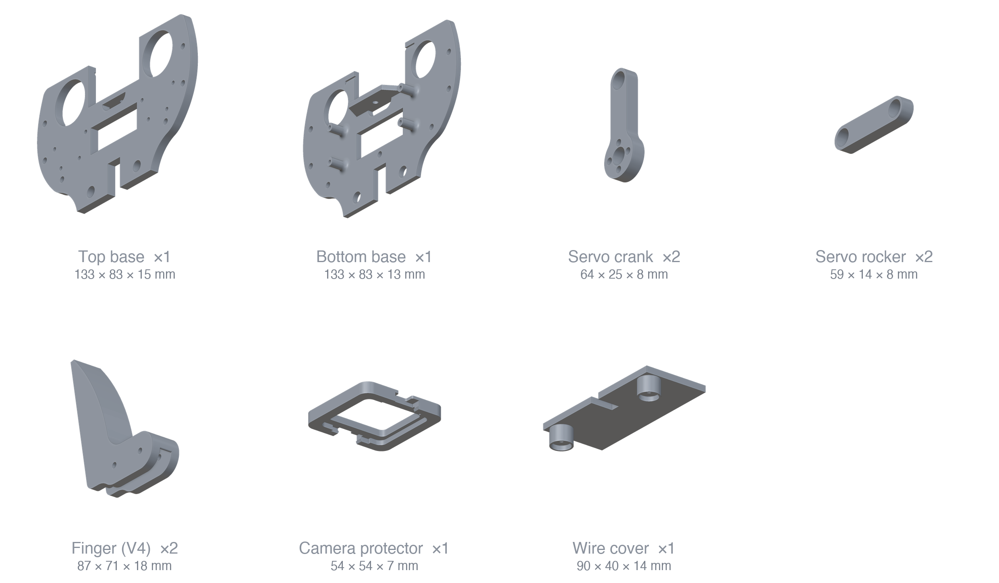
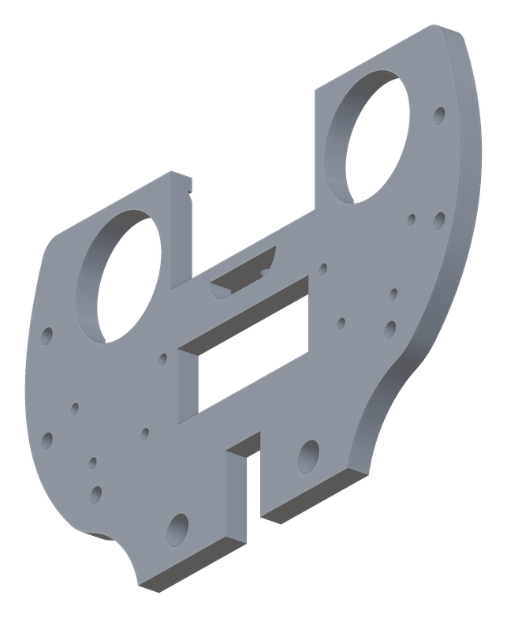
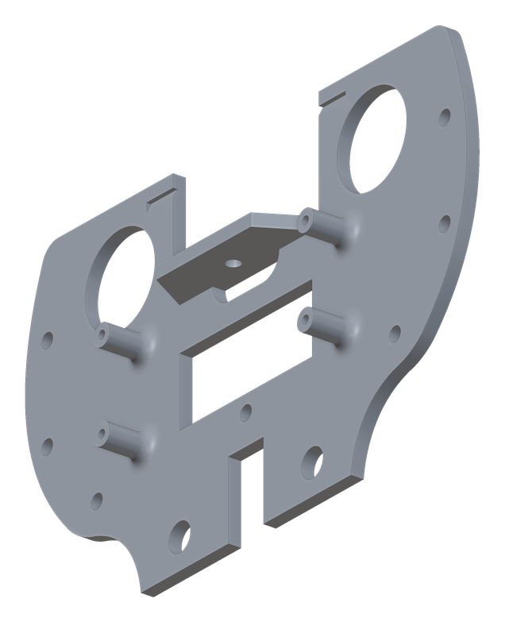
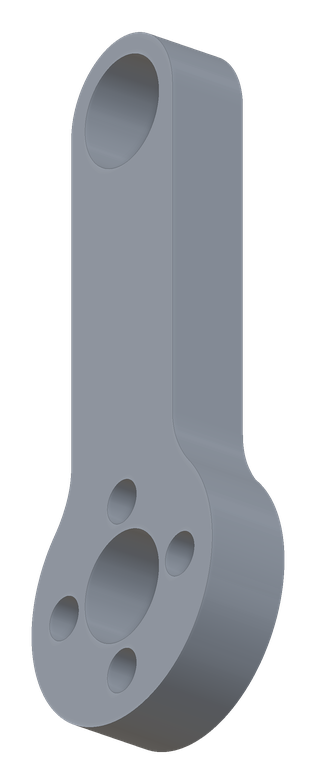
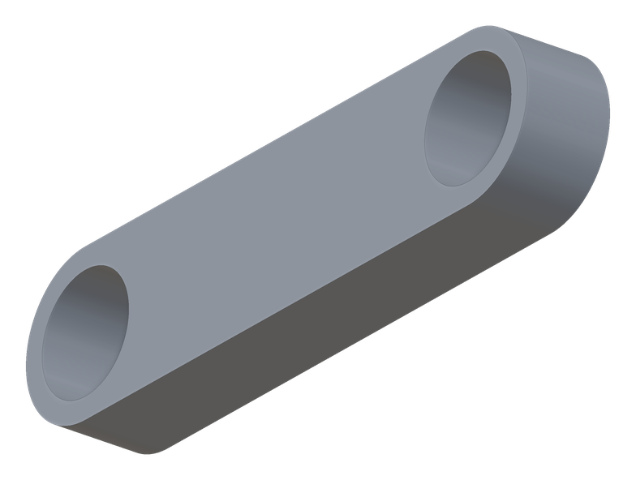
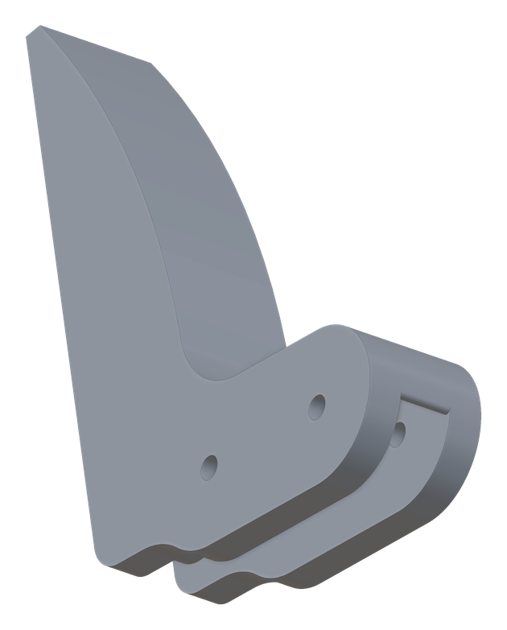
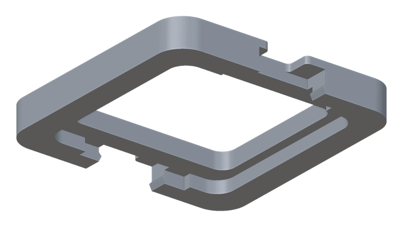
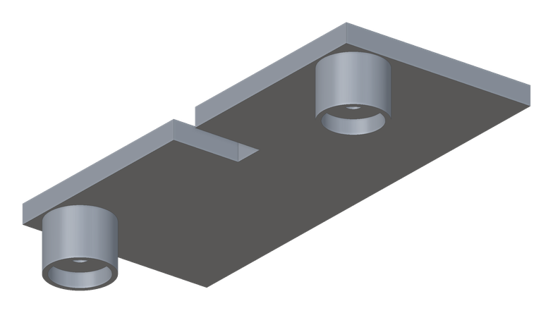
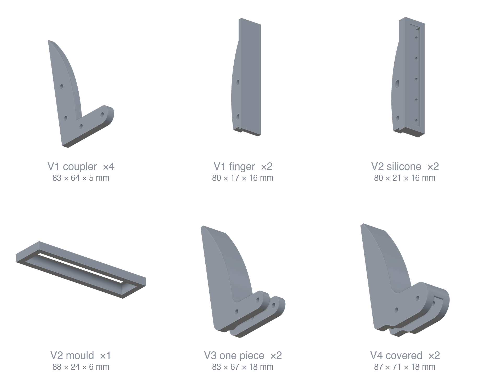

<div align="center">



# Magpie Gripper

**Design and manufacture of the MAGPIE hand — version 2**

A 3D-printed parallel-jaw gripper with a depth camera in its palm, built from
two smart servos and about $455 of off-the-shelf parts.

[](Documentation/assembly.md)
[](Documentation/BOM.md)
[](https://github.com/correlllab/MAGPIE)
[](https://arxiv.org/abs/2402.06018)
[](LICENSE)

</div>

---

Two AX-12A servos drive a four-bar linkage — crank and rocker — that keeps the
fingers parallel through their whole travel, an OpenRB-150 board controls them,
and an Intel RealSense D405 looks out from the palm. Because the servos are
current-limited, the gripper can be told how hard to squeeze; because the camera
is between the fingers rather than on the wrist, it can still see the object at
the moment of contact.

This repository is the **hardware**: models, bill of materials, a photographed
step-by-step build, and the record of what changed from version 1. The software
that drives it lives in [correlllab/MAGPIE](https://github.com/correlllab/MAGPIE).

**Version 2 is a simplification.** Fewer parts, fewer fasteners, and less to get
wrong: the three-piece finger became one piece, the camera moved from slots to
holes so it lands in the same place every time, the controller's standoffs are
printed into the base plate, and the two-piece camera cover became one part that
snaps on. It weighs **390 g** on the bench scale, against 414 g for the hand in
the paper. [What changed, and why →](Documentation/MagpieDesignChanges.md)

|  |  |
| --- | --- |
| **Actuation** | 2 × Dynamixel AX-12A, four-bar linkage per finger |
| **Control** | OpenRB-150, one USB-C cable |
| **Sensing** | Intel RealSense D405 in the palm |
| **Mass** | ≈ 390 g ([weighed](Documentation/assembly_photos/IMG_5022.jpg)) |
| **Parts cost** | ≈ $455, of which the camera is $272 |
| **Printed** | 9 pieces, ≈ 150 cm³, PLA at 30 % gyroid infill |
| **CAD** | Onshape, [live document](https://cad.onshape.com/documents/ebf3bee4cb16cf8695a8fb0b/w/7cb77bbbbc0cfa118c533903/e/7df3b127506ca0a4fec0e6dc?renderMode=0&uiState=6a8f814e30e68e6c32fd1782) · STLs in [`CAD/`](CAD) |

## Build one

**1 · Print.** Everything in [`CAD/`](CAD), PLA, 30 % gyroid infill with 2 mm
borders and organic supports. The rocker and the crank are the parts that break,
so give them at least 50 % infill.

<div align="center">

</div>

| | Part | Qty | Size | File |
| --- | --- | ---: | --- | --- |
|  | Top base | 1 | 133 × 83 × 15 mm | [`Top Base.stl`](CAD/Top%20Base.stl) |
|  | Bottom base | 1 | 133 × 83 × 13 mm | [`Bottom Base.stl`](CAD/Bottom%20Base.stl) |
|  | Servo crank | 2 | 64 × 25 × 8 mm | [`Crank.stl`](CAD/Crank.stl) |
|  | Servo rocker | 2 | 59 × 14 × 8 mm | [`Rocker.stl`](CAD/Rocker.stl) |
|  | Finger | 2 | 87 × 71 × 18 mm | [`Finger V4 - covered.stl`](CAD/Finger%20V4%20-%20covered.stl) |
|  | Camera protector | 1 | 54 × 54 × 7 mm | [`Camera Cover.stl`](CAD/Camera%20Cover.stl) |
|  | Wire cover | 1 | 90 × 40 × 14 mm | [`Wire Cover.stl`](CAD/Wire%20Cover.stl) |

The two plates are not interchangeable: the top is 15 mm thick and plain, the
bottom is 13 mm and carries the four printed standoffs the OpenRB-150 sits on —
which is why it is drawn from its reverse face above.

**2 · Buy.** [The bill of materials](Documentation/BOM.md) lists both versions.
For V2: two AX-12A servos, an OpenRB-150, a RealSense D405, six 5 mm bearings,
M2/M3 hardware, and grip tape.

**3 · Assemble.** [The assembly guide](Documentation/assembly.md) — eleven steps,
photographed, from taping the fingers to setting the servo IDs. Also available as
[a PDF to print](Documentation/Magpie%20Assembly%20Guide.pdf).

## The fingers are the experiment

Grip is where a jaw gripper is won or lost, so the finger is the part that has
been through the most versions. All four are in [`CAD/`](CAD) and interchangeable:

<div align="center">

</div>

- **V1** — a separate coupler and finger, so the contact face could be printed in TPU.
- **V2** — a cast silicone finger, with the mould to make it.
- **V3** — finger and coupler as one part; simpler to print and assemble, and it needs grip tape to match the older grip.
- **V4** — V3 plus a cover that takes the play out of the joint and stiffens it.

## Driving it

Force control, the palm camera, grasp planning and the behaviour-tree/PDDL layer
are in **[correlllab/MAGPIE](https://github.com/correlllab/MAGPIE)** — a Python
package, no ROS. Once the gripper is wired and its servo IDs are set, that is
where to go next.

## What is in here

```
CAD/                      STL models — gripper mechanism and every finger variant
Documentation/
  assembly.md             the build, step by step, on GitHub
  Magpie Assembly Guide.pdf   the same guide, to print
  BOM.md                  bill of materials, V1 and V2
  MagpieDesignChanges.md  what changed from V1, and why
  figures/                the guide's figures
  assembly_photos/        every build photo, full resolution
  design_photos/          CAD comparisons, old against new
  renders/                part renders, generated from the STLs
  paper/                  the paper this hand comes from
tools/                    regenerate the renders and the figures
```

## License

MIT — see [LICENSE](LICENSE). The models, the bill of materials and the guide are
yours to print, modify and sell; the software that drives the gripper,
[correlllab/MAGPIE](https://github.com/correlllab/MAGPIE), is MIT too.

Built in the [Correll Lab](https://www.colorado.edu/lab/correll/) at the
University of Colorado Boulder.

## Citation

The hand this one descends from — its four-bar linkage, its force
characterisation and the manipulation pipeline built on it — is described in
[**A versatile robotic hand with 3D perception, force sensing for autonomous
manipulation**](https://arxiv.org/abs/2402.06018) (RSS 2024 Workshop on
Perception and Manipulation Challenges for Warehouse Automation, Daejeon, Korea).
A copy is kept here at
[`Documentation/paper/2402.06018-magpie.pdf`](Documentation/paper/2402.06018-magpie.pdf),
recompressed to keep a clone small — [arXiv](https://arxiv.org/abs/2402.06018) has
the original.

```bibtex
@inproceedings{correll2024versatile,
  title     = {A versatile robotic hand with {3D} perception, force sensing for
               autonomous manipulation},
  author    = {Correll, Nikolaus and Kriegman, Dylan and Otto, Stephen and
               Watson, James},
  booktitle = {RSS Workshop on Perception and Manipulation Challenges for
               Warehouse Automation},
  address   = {Daejeon, Korea},
  year      = {2024},
  eprint    = {2402.06018},
  archivePrefix = {arXiv},
  primaryClass  = {cs.RO},
  url       = {https://arxiv.org/abs/2402.06018}
}
```
